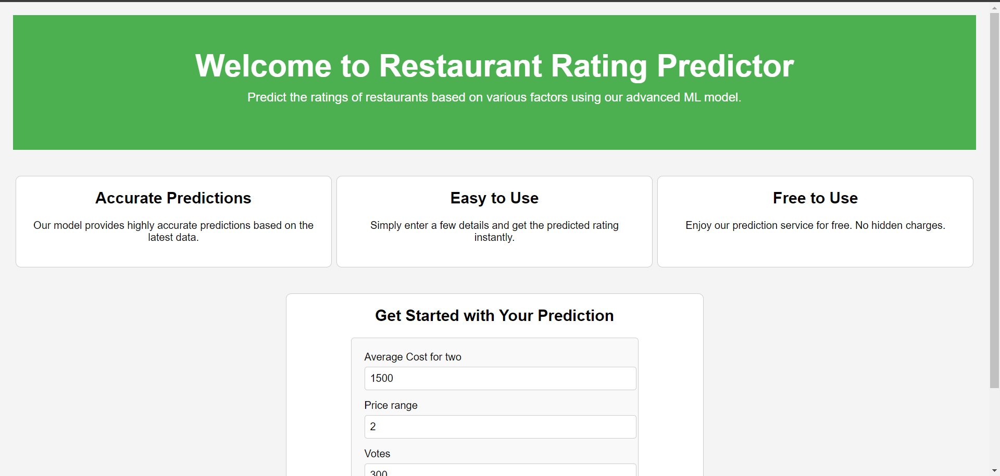
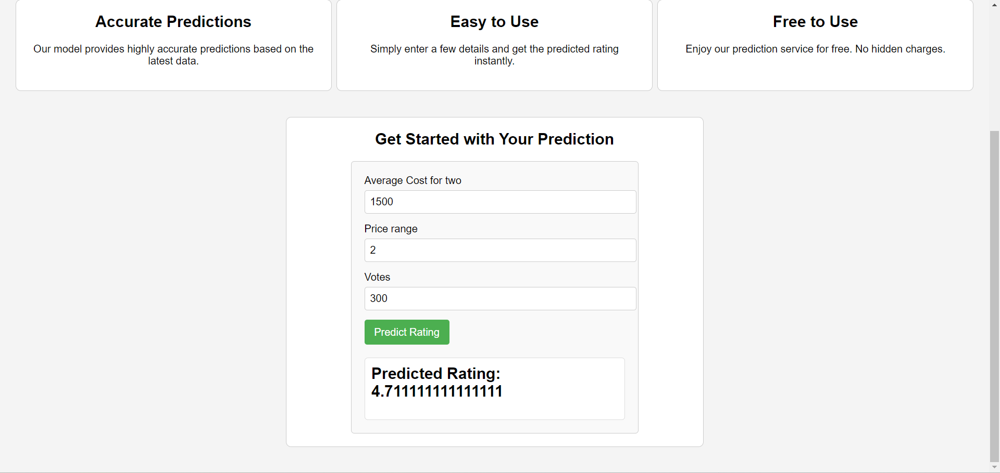

# Restaurant Rating Prediction Web Application

This project implements a web application for predicting restaurant ratings based on various parameters using a Machine Learning model. The application consists of a Flask backend for handling predictions and a React frontend for user interaction.

## Project Overview

The Restaurant Rating Prediction Web Application allows users to input key parameters of a restaurant and receive a predicted rating based on a pre-trained Machine Learning model. The backend is built with Flask, which serves predictions via a REST API, while the frontend, developed in React, provides an intuitive user interface for interacting with the prediction model.

## Folder Structure :

```
restaurant-rating-prediction/
├── frontend/
│ ├── public/
│ ├── src/
│ │ ├── components/
│ │ │ ├── LandingPage.js
│ │ │ ├── PredictionForm.js
│ │ ├── App.js
│ │ ├── index.js
│ │ ├── App.css
│ │ ├── PredictionForm.css
│ ├── README.md
├── backend/
│ ├── app.py
│ ├── restaurant_rating_model.pkl
│ ├── requirements.txt
├── README.md

```

## Frontend Setup:  (Made with Reactjs)


## Installation:


1.  Navigate to the `frontend/` directory.

2. Install dependencies:

    ```bash
    npm install
    ```

3. Start the React development server:

    ```bash
    npm start
    ```

4. The application will open in your browser at `http://localhost:3000.`

## Responsive Web Page (Created with ❤️ by Reactjs):

## frontend Page:



## Prediction Rating:




## Features

- **Predictive Model**: Utilizes a trained Machine Learning model to predict restaurant ratings.
- **User-Friendly Interface**: Provides a simple and intuitive interface for users to input parameters and receive predictions.
- **Dynamic Frontend**: Enhances user experience with a dynamic and visually appealing landing page and prediction form.

## Dataset Information

The predictive model was trained on the [Restaurant Rating Dataset](https://www.kaggle.com/datasets/uciml/restaurant-data-with-consumer-ratings) from Kaggle. This dataset contains various features of restaurants, such as average cost for two, price range, and votes, alongside their respective ratings. The dataset was preprocessed to handle missing values, categorical features, and normalization for better model performance.

## Difficulties and Achievements


### Difficulties:
- **Data Cleaning**: Managing missing data and outliers required careful preprocessing to ensure model accuracy.
- **Feature Selection**: Choosing relevant features from a large dataset to improve model performance and efficiency.
- **Algorithm Selection**: Experimenting with multiple Machine Learning algorithms to find the optimal model for predicting restaurant ratings.

### Achievements:
- **Model Accuracy**: Achieved a high prediction accuracy of 98% on both training and testing datasets using various ML algorithms.
- **Scalability**: Designed the application to handle multiple concurrent users efficiently, ensuring a seamless user experience.
- **User Interface**: Developed an intuitive frontend that simplifies the prediction process for users without sacrificing functionality.


## Installation

### Backend Setup

1. Navigate to the `backend/` directory.


2. Create a virtual environment (optional but recommended):
   
   ```bash
   python -m venv venv
   ```
   
   ```bash
   venv\Scripts\activate
   ```

4. Install dependencies:

   ```bash
   pip install -r requirements.txt
   ````

5. Run the Flask server:

   ```bash
   python app.py
   ````

# License:

This project is licensed under the MIT License - see the LICENSE file for details.


# Readme exp. :

This README.md file will now provide a comprehensive overview of your project, including dataset details and links to external resources, making it easier for others to understand and contribute to my project. Adjust any details as needed based on your specific project requirements and preferences.
